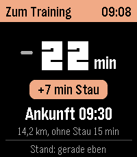
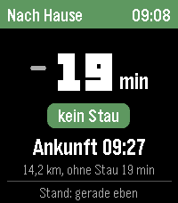

# Fahrzeit

Pebble-App, die live anzeigt, wie lange die Autofahrt zwischen zwei Orten gerade dauert, mit Verkehr. Sie fragt TomTom direkt vom Handy aus ab und braucht weder Home Assistant noch einen eigenen Server. Man braucht nur einen kostenlosen API-Key von TomTom.

Schwester-Projekt: [pebble-fahrzeit-HA](https://github.com/T-o-n-i/pebble-fahrzeit-HA) speist dieselbe Anzeige aus Home-Assistant-Sensoren.

Plattform: emery (Pebble Time 2).

 

## Einrichten

1. Auf [developer.tomtom.com](https://developer.tomtom.com) ein kostenloses Konto anlegen und einen API-Key erzeugen. Zahlungsdaten sind nicht nötig. Das Freikontingent gilt pro Monat und für das ganze Konto, alle Keys teilen es sich. Für die Routing API sind es 20.000 Abfragen im Monat (Stand Oktober 2026, siehe [TomTom Pricing](https://docs.tomtom.com/pricing)). Ist es aufgebraucht, werden Abfragen bis zum nächsten Abrechnungszeitraum blockiert, Kosten entstehen nicht.
2. `build/fahrzeit.pbw` auf das Handy bringen, etwa per AirDrop, und in der Pebble-App öffnen.
3. In der Pebble-App die Einstellungen von „Fahrzeit“ öffnen, Key und Orte eintragen, speichern.

## Einstellungen

| Feld | Standard | |
|---|---|---|
| API-Key | leer | TomTom-Key |
| Ort 1 | leer | Start des Hinwegs |
| Ort 2 | leer | Ziel des Hinwegs |
| Bezeichnung Hinweg | Zur Arbeit | Kopfzeile für Ort 1 → Ort 2, bis 20 Zeichen |
| Bezeichnung Rückweg | Nach Hause | Kopfzeile für Ort 2 → Ort 1 |
| Rückweg ab | 12:00 | ab dieser Uhrzeit öffnet die App mit dem Rückweg |
| Zuschlag in % | 0 | Aufschlag auf die Fahrzeit von TomTom, für beide Richtungen |
| Puffer Hinweg in min | 0 | feste Minuten obendrauf, etwa für Parkplatzsuche und Fußweg |
| Puffer Rückweg in min | 0 | dasselbe für den Rückweg |

TomTom rechnet eher optimistisch. Angezeigt wird deshalb `Fahrzeit von TomTom × (1 + Zuschlag) + Puffer der Richtung`, gerundet auf ganze Minuten. Der Zuschlag gleicht aus, was mit der Strecke wächst, der Puffer feste Zeiten wie die Einfahrt ins Parkhaus. Auf der Uhr wird die Korrektur nicht eigens angezeigt. Ankunftszeit und „ohne Stau“ rechnen mit der korrigierten Fahrzeit, Stau-Minuten und Farbe bleiben bei den Werten von TomTom.

Orte gehen als Koordinaten oder als Adresse:

- **Koordinaten**: `50.04885, 8.55722`, `50.04885 8.55722` oder mit Dezimalkomma `50,04885; 8,55722`.
- **Adresse**: wird bei der ersten Abfrage einmal über die TomTom-Suche aufgelöst und dann gemerkt. Erst wenn sich der Text ändert, wird neu gesucht.

Am genauesten sind Koordinaten auf der Zufahrt, etwa zum Parkhaus. Ein Routendienst legt jeden Punkt auf die nächste Straße. Liegt der Punkt mitten in einem großen Gebäude oder neben einer Autobahn, kann er auf der falschen Straße landen, und die Fahrzeit stimmt nicht.

Key, Orte, Korrektur und gefundene Koordinaten liegen nur im `localStorage` von PebbleKit JS auf dem Handy. An die Uhr gehen nur die beiden Bezeichnungen und die Umschaltzeit.

## Anzeige und Bedienung

- **Kopfzeile** mit Bezeichnung der Richtung und Uhrzeit, Farbe nach Stau: grün bis 2 min Verzögerung, gelb bis 10 min, rot darüber.
- **Fahrzeit** in Minuten mit Trendpfeil gegenüber der vorigen Abfrage.
- **Stau**, **Ankunft** bei Abfahrt jetzt, Strecke und Fahrzeit ohne Stau.
- **UP** oder **DOWN** wechselt die Richtung, jede Richtung behält ihren letzten Stand.
- Die App fragt beim Öffnen und dann alle 3 Minuten ab, nur die angezeigte Richtung. Nach 30 Minuten pausiert sie. **SELECT** fragt sofort ab und startet die 30 Minuten neu.

Eine halbe Stunde offene App sind etwa 11 Abfragen, bei Adressen beim ersten Mal je eine Suche mehr. Bei zwei Sitzungen pro Arbeitstag sind das rund 500 im Monat, weit unter dem Freikontingent.

## Fehlermeldungen

| Meldung | Bedeutung |
|---|---|
| API-Key fehlt: Einstellungen | kein Key eingetragen |
| Orte fehlen: Einstellungen | Ort 1 oder Ort 2 leer |
| Key falsch oder Kontingent leer | TomTom lehnt die Abfrage ab (403); das passiert bei einem falschen Key und auch, wenn das Monatskontingent aufgebraucht ist |
| Zu viele Anfragen, kurz warten | zu viele Abfragen in kurzer Zeit (429) |
| Keine Route gefunden | TomTom findet keine Autoroute zwischen den Orten |
| Ort 1 nicht gefunden / Ort 2 nicht gefunden | die Adresse liefert keinen Treffer |
| TomTom nicht erreichbar / TomTom antwortet nicht | Netzwerkfehler oder keine Antwort in 15 Sekunden |
| Handy nicht verbunden / Keine Antwort vom Handy | Uhr erreicht PebbleKit JS nicht |

## Aufbau

| Datei | Inhalt |
|---|---|
| `src/c/main.c` | Uhr: Anzeige, Richtung, Taktung, letzter Stand je Richtung |
| `src/pkjs/index.js` | Handy: Einstellungen lesen, Adressen auflösen, Route bei TomTom abfragen |
| `src/pkjs/config.js` | Einstellungsseite (Clay) |

Ablauf: Beim Start meldet PebbleKit JS `JS_READY` mit Bezeichnungen und Umschaltzeit. Die Uhr wählt die Richtung und schickt `REQUEST` mit `DIRECTION` (0 = Hinweg, 1 = Rückweg). Das Handy ruft die [TomTom Routing API](https://developer.tomtom.com/routing-api/documentation/tomtom-maps/product-information/introduction) mit `traffic=true` auf und schickt die korrigierten Minuten, Verzögerung, Strecke und Zeitpunkt zurück.

## Bauen

```bash
pebble build
pebble install --emulator emery
```

Nach neuen Message-Keys in `package.json` vorher `pebble clean`, sonst fehlen die `MESSAGE_KEY_*`-Konstanten im C-Code.
